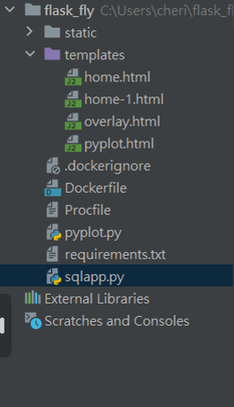
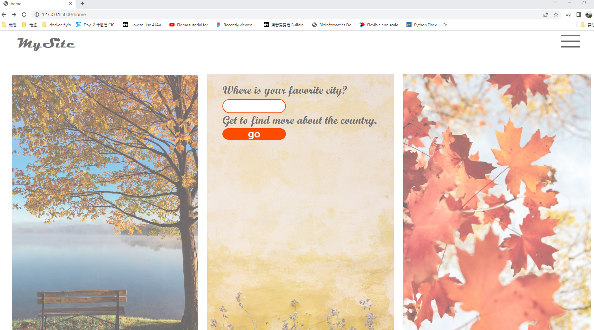

# flask_jinja2
My example for web developing, trying the combination of Flask、Jinja2、MySql and front end design with Adobe XD.

First I design these 3 pages in Adobe XD, then export them as html files and edit the form/input part manually.

I use MySql and its sample db "world", to use SQLAlchemy, each table in the database needs a mapping class defined in the python 
program.

The folder structure has to be as following:

A screen display of this website: 'your favorite city':

